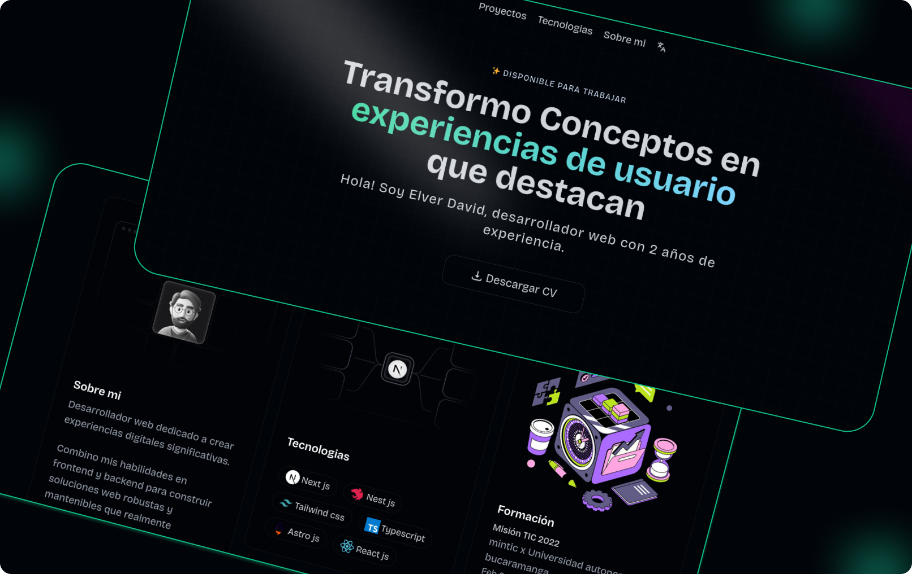

<h1 style="color:#6ee7b7; font-weight: 700;text-align: center;">Portafolio Web</h1>
 

 
 

Desarrollado con **AstroJS**, este proyecto demuestra mis habilidades como **desarrollador web**, creando experiencias rápidas, eficientes y visualmente atractivas. Su objetivo es destacar mi capacidad para ofrecer soluciones web escalables y personalizadas.  

🔹 **Tecnologías:** AstroJS y Tailwind CSS.  
🔹 **Enfoque:** Usabilidad, rendimiento y diseño adaptable.  

 

## 📫 ¡Contáctame!

 
Estoy disponible para nuevos proyectos y colaboraciones. ¡Hablemos! 
🔗 [Portafolio](https://elvportafolio.website/)  
📩 [Correo](mailto:elverdavid0839@gmail.com)  
🌐 [LinkedIn](https://www.linkedin.com/in/elverdavid-dev)  
